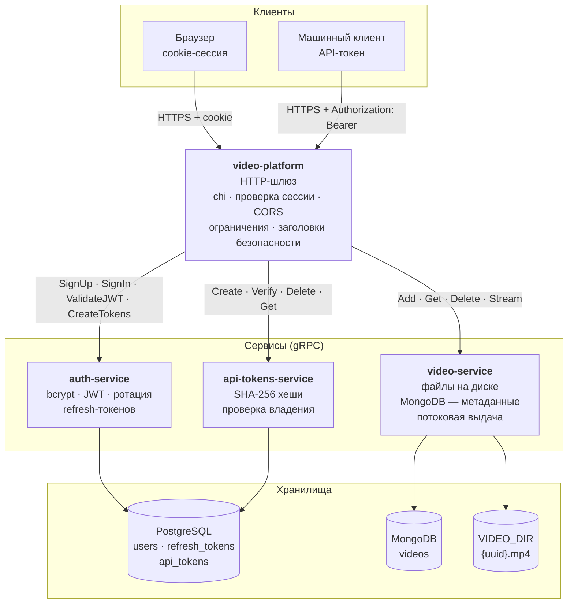
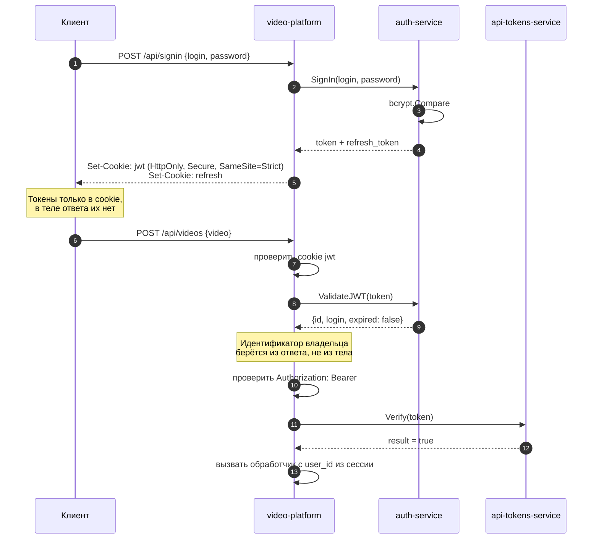

# video-platform

HTTP-шлюз системы видеохостинга. Принимает запросы браузера и машинных клиентов,
проверяет сессию и API-токен, затем обращается к сервисам по gRPC.

Это шлюз из четырёх независимо развёртываемых сервисов:

| Репозиторий | Роль |
|---|---|
| [grpc-contract](https://github.com/nikaydo/grpc-contract) | Контракты gRPC, общая библиотека |
| [auth-service](https://github.com/nikaydo/auth-service) | Регистрация, вход, выпуск и ротация токенов |
| [api-tokens-service](https://github.com/nikaydo/api-tokens-service) | Выпуск и проверка API-токенов для машинных клиентов |
| [video-service](https://github.com/nikaydo/video-service) | Хранение и потоковая выдача видео |

## Архитектура



### Как проходит проверка доступа



Идентификатор пользователя попадает в обработчики **только** из проверенного
access-токена. Ни один эндпоинт не принимает его из тела запроса, поэтому
принадлежность ресурса подделать нельзя.

## Запуск всей системы

```bash
git clone https://github.com/nikaydo/video-platform.git
cd video-platform

# Клоны сервисов в соседние каталоги
task clone-services

# Поднять всё
task up
```

Или без Task:

```bash
for s in auth-service api-tokens-service video-service; do
  git clone --depth 1 "https://github.com/nikaydo/$s.git" "../$s"
done
docker compose up --build
```

Шлюз доступен на <http://localhost:8080>, проверка готовности — `GET /api/health`.

Сервисы запускаются в порядке готовности зависимостей: PostgreSQL и MongoDB
проверяются healthcheck'ами, и только после этого стартуют gRPC-сервисы.

Каталог [grpc-contract](https://github.com/nikaydo/grpc-contract) клонировать
не нужно: каждый сервис тянет контракт как обычный модуль по версии из своего
`go.mod`.

### Запуск только шлюза

```bash
cp .env.example .env
task run
```

Шлюз не требует базы: сессии и токены хранят сервисы. Поднять их можно
отдельно или вместе с системой.

## Конфигурация

| Переменная | По умолчанию | Назначение |
|---|---|---|
| `HOST` / `PORT` | `0.0.0.0` / `8080` | Адрес HTTP-сервера |
| `AUTH_HOST` / `AUTH_PORT` | `auth-service` / `50051` | Адрес сервиса авторизации |
| `TOKEN_HOST` / `TOKEN_PORT` | `api-tokens-service` / `50052` | Адрес сервиса токенов |
| `VIDEO_HOST` / `VIDEO_PORT` | `video-service` / `50053` | Адрес сервиса видео |
| `COOKIE_NAME` | `jwt` | Имя cookie с access-токеном |
| `COOKIE_SECURE` | `true` | Отправлять cookie только по HTTPS. Локально по http — `false` |
| `SESSION_TTL` | `24h` | Срок жизни cookie сессии |
| `MAX_REQUEST_BYTES` | `26214400` | Предел тела запроса |
| `MAX_UPLOAD_BYTES` | `20971520` | Предел размера видео |
| `AUTH_RATE_LIMIT` / `AUTH_RATE_WINDOW` | `10` / `1m` | Ограничение частоты входа |
| `GRPC_TIMEOUT` | `30s` | Таймаут одного вызова gRPC |
| `STATIC_DIR` | `web` | Каталог со статикой |

Конфигурация проверяется при старте: совпадающие порты сервисов, пустые хосты и
неположительные таймауты приводят к отказу запуска.

## API

### Сессия

| Метод | Путь | Назначение |
|---|---|---|
| `POST` | `/api/signup` | Регистрация. Сессия выдаётся сразу |
| `POST` | `/api/signin` | Вход |
| `POST` | `/api/refresh` | Обновить сессию. Ротация refresh-токена |
| `POST` | `/api/logout` | Завершить сессию |
| `GET` | `/api/me` | Текущий пользователь |
| `GET` | `/api/health` | Проверка готовности |

### API-токены (нужна сессия)

| Метод | Путь | Назначение |
|---|---|---|
| `POST` | `/api/tokens` | Выпустить токен. Значение возвращается один раз |
| `GET` | `/api/tokens` | Список хешей своих токенов |
| `DELETE` | `/api/tokens` | Отозвать токен |

### Видео (нужны сессия и API-токен)

| Метод | Путь | Назначение |
|---|---|---|
| `POST` | `/api/videos` | Загрузить видео (multipart, поле `video`) |
| `GET` | `/api/videos?name=…` | Список своих видео |
| `DELETE` | `/api/videos/{id}` | Удалить видео |
| `GET` | `/api/videos/{id}/stream` | Потоковая выдача видео |

API-токен передаётся заголовком:

```
Authorization: Bearer vpt_…
```

Параметр `?token=` **не принимается**: он попадал бы в журналы веб-сервера и
прокси, в историю браузера и в заголовок `Referer`.

## Решения и их цена

### Токены только в cookie

Access-токен и refresh-токен устанавливаются как HttpOnly-cookie. Раньше
access-токен возвращался ещё и в теле ответа — это полностью обесценивало
HttpOnly, потому что тело ответа доступно JavaScript.

*Цена:* cookie неудобны для нативных клиентов и для сервер-серверных вызовов:
им нужен обмен по коду авторизации. Для машинных клиентов вместо этого
используется отдельный API-токен.

### Идентификатор владельца из сессии

Обработчики берут `user_id` из контекста, куда его положил middleware после
проверки access-токена. Ни один эндпоинт не принимает идентификатор из тела
запроса, а разбор JSON отклоняет неизвестные поля — отправить `userId` в
теле просто не получится.

*Цена:* чтобы выполнить операцию от имени пользователя, нужно иметь его
действительную сессию. Машинным клиентам это не подходит, поэтому им выдаётся
API-токен, а владелец берётся из сессии инициатора.

### Поле `expired` проверяется

Сервис авторизации различает «токен недействителен» и «срок истёк», возвращая
признак `expired`. Раньше middleware это поле игнорировал, из-за чего
просроченный access-токен проходил проверку, а просроченный refresh-токен
проходил ротацию.

При истечении access-токена в ответ ставится заголовок `X-Auth-Reason:
expired`, по которому клиент понимает, что нужно обновить сессию, а не
показывать ошибку входа.

*Цена:* решение о том, что делать с просроченным токеном, принимает шлюз. Он
ставит флаг, а проверка самого флага покрыта тестом.

### Детали ошибок не показываются клиенту

Сообщения ошибок gRPC начиная с `Internal` заменяются нейтральным текстом.
Наружу не попадают названия таблиц, колонок и адреса внутренних сервисов.

*Цена:* при разборе проблемы в логах нужен `request_id` из заголовка
`X-Request-ID`.

### Владение определяется на стороне сервиса

Шлюз передаёт `user_id`, а сервис проверяет его в своём хранилище. Шлюз не
пытается решить, чей это ресурс: у него нет доступа к данным.

*Цена:* доверие между сервисами. Если вызвать сервис напрямую с чужим
`user_id`, он выполнит операцию — защита строится на том, что прямой доступ к
сервисам закрыт сетью.

### Контракт как обычный модуль

Зависимость на контракт объявлена версией в `go.mod`:

```
github.com/nikaydo/grpc-contract v0.4.0
```

Раньше вместо версии была замена на локальный каталог `../grpc-contract`, а в
репозитории лежали теги `v1` и `v0.0.1`–`v0.0.9`, указывавшие на код до
исправлений. Команда `go get` без версии выбрала бы `v1` и получила контракт без
обязательных полей владельца и с целой передачей видео. Локальная замена также
не работала в сборке образа: `COPY ../grpc-contract` выходит за пределы build-
контекста, и в образ попадал пустой каталог.

*Цена:* правки контракта нужно сначала выпустить, и только потом обновлять
версию в сервисах. Для совместной работы над контрактом предусмотрена локальная
замена — она в `go.mod` не попадает.

### Потоковая передача видео

Поток gRPC пробрачивается в HTTP по мере поступления сообщений, а ответ
сбрасывается через `Flush`. Раньше `SearchVideo` вызывал `WriteHeader` дважды:
заголовки уходили до установки `Content-Type`, поэтому клиент получал ответ
с неверным типом.

*Цена:* `WriteTimeout` сервера приходится делать большим — 10 минут вместо
обычных 30 секунд. Видео не может передаваться бесконечно, иначе соединение
займёт ресурс.

### Ограничение частоты только на авторизации

`/api/signup` и `/api/signin` защищены счётчиком на источник. Остальные
эндпоинты не ограничены: считать обращения к каждому видео дороже, чем
защитить от них.

*Цена:* перебор паролей ограничен, а вот поток запросов к списку видео —
нет. При реальной нагрузке понадобится ограничение на прикладном уровне или
на уровне обратного прокси.

## Тесты

```bash
task test    # модульные, с -race
task cover   # отчёт о покрытии
```

Покрытие: `router` — 96%, `config` — 89%, `handlers` — 48%, всего 53%.
Без покрытия остаются точка входа, gRPC-клиенты и сборка HTTP-сервера: они
проверяются только интеграционно, в CI их компилирует сборка образа.

Ключевые тесты закрывают регрессии:

- `TestSignInDoesNotLeakTokensInBody` — токены не попадают в тело ответа
- `TestRequireAPIKeyRejectsMissingHeader` — токен в query-строке не принимается
- `TestAuthenticateRejectsExpiredToken` — просроченный токен не проходит
- `TestOwnershipComesFromSession` — владелец берётся из сессии
- `TestUnknownFieldIsRejected` — `userId` в теле запроса отклоняется
- `TestGRPCErrorsDoNotLeakDetails` — детали ошибок не уходят клиенту
- `TestProtectedRoutesRequireAuth` — закрытые эндпоинты отвечают 401, а не 404
- `TestPanicIsRecovered` — паника в обработчике не роняет процесс
- `TestStaticRouteIgnoresPathInRequest` — имя файла не берётся из пути запроса

## Ограничения

- Нет TLS: защищённое соединение обеспечивается обратным прокси перед шлюзом
- Межсервисный gRPC без mTLS: канал защищён сетью, а не шифрованием
- Нет версионирования API: изменение путей ломает совместимость с клиентами
- Нет ограничения частоты на операции с видео
- Фронтенд — один самодостаточный файл без сборки

## Лицензия

MIT — см. [LICENSE](LICENSE).