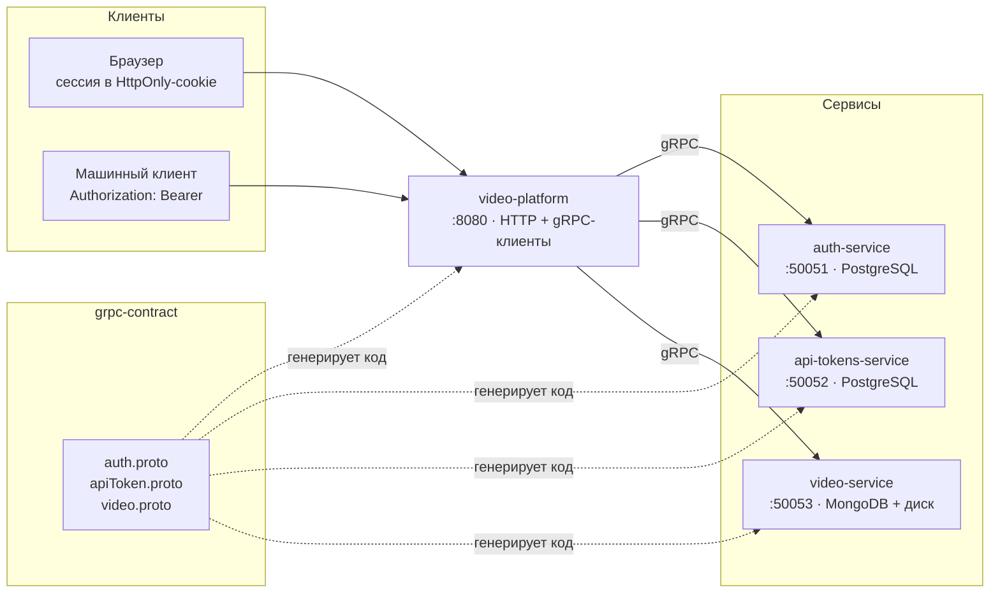

# video-platform

HTTP-шлюз системы видеохостинга. Принимает запросы браузера и машинных
клиентов, проверяет сессию и API-токен, затем обращается к сервисам по gRPC.

Это точка входа в систему из четырёх сервисов:



## Стек

Go 1.24 · `net/http` + `chi` · gRPC-клиенты · `caarlos0/env` · slog ·
Docker · GitHub Actions

## Запуск всей системы

```bash
git clone https://github.com/nikaydo/video-platform.git
cd video-platform

# Контракт нужен всем четырём сервисам как локальный модуль
git clone --depth 1 https://github.com/nikaydo/grpc-contract.git ../grpc-contract
git clone --depth 1 https://github.com/nikaydo/auth-service.git ../auth-service
git clone --depth 1 https://github.com/nikaydo/api-tokens-service.git ../api-tokens-service
git clone --depth 1 https://github.com/nikaydo/video-service.git ../video-service

# Подставьте настоящий ключ при первом запуске
export JWT_SECRET="$(openssl rand -base64 48)"

docker compose up --build
```

Шлюз доступен на <http://localhost:8080>. Регистрация: <http://localhost:8080/login>.

Только шлюз, при уже запущенных сервисах:

```bash
cp .env.example .env      # указать хосты и порты сервисов
task build
./bin/video-platform
```

## Конфигурация

| Переменная | По умолчанию | Назначение |
|---|---|---|
| `HOST` / `PORT` | `0.0.0.0` / `8080` | Адрес HTTP-сервера |
| `STATIC_DIR` | `web` | Каталог со статикой |
| `AUTH_HOST` / `AUTH_PORT` | `auth-service` / `50051` | Сервис авторизации |
| `TOKEN_HOST` / `TOKEN_PORT` | `api-tokens-service` / `50052` | Сервис API-токенов |
| `VIDEO_HOST` / `VIDEO_PORT` | `video-service` / `50053` | Сервис видео |
| `COOKIE_NAME` | `jwt` | Имя cookie с access-токеном |
| `SESSION_TTL` | `24h` | Срок жизни cookie |
| `COOKIE_SECURE` | `true` | Отправлять cookie только по HTTPS |
| `MAX_REQUEST_BYTES` | `26214400` | Предел тела запроса (25 МиБ) |
| `MAX_UPLOAD_BYTES` | `20971520` | Предел видеофайла (20 МиБ) |
| `REQUEST_TIMEOUT` | `60s` | Предел обработки запроса |
| `GRPC_TIMEOUT` | `30s` | Таймаут вызова сервиса |
| `SHUTDOWN_TIMEOUT` | `30s` | Ожидание при остановке |
| `AUTH_RATE_LIMIT` | `10` | Попыток входа с одного адреса |
| `AUTH_RATE_WINDOW` | `1m` | Окно ограничения частоты |

Порты сервисов проверяются на совпадение: два сервиса на одном порту привели бы
к неразрешимому конфликту при запуске.

## API

| Метод | Путь | Назначение |
|---|---|---|
| `GET` | `/api/health` | Проверка готовности |
| `POST` | `/api/signup` | Регистрация. Сессия выдаётся сразу |
| `POST` | `/api/signin` | Вход |
| `POST` | `/api/refresh` | Обновить сессию по refresh-токену |
| `POST` | `/api/logout` | Завершить сессию |
| `GET` | `/api/me` | Текущий пользователь |
| `POST` | `/api/tokens` | Выпустить API-токен. Значение возвращается один раз |
| `GET` | `/api/tokens` | Хеши выпущенных токенов |
| `DELETE` | `/api/tokens` | Отозвать токен |
| `POST` | `/api/videos` | Загрузить видео (`multipart/form-data`) |
| `GET` | `/api/videos?name=…` | Список видео |
| `DELETE` | `/api/videos/{id}` | Удалить видео |
| `GET` | `/api/videos/{id}/stream` | Потоковая выдача видео |

## Решения и их цена

### Токены только в HttpOnly-cookie

Access- и refresh-токены возвращаются исключительно в cookie с флагами
`HttpOnly`, `Secure` и `SameSite=Strict`.

Раньше access-токен возвращался ещё и в теле ответа. Тело ответа доступно
JavaScript, поэтому такая выдача полностью обесценивала `HttpOnly`: токен всё
равно можно было украсть через XSS.

*Цена:* API недоступен из нативных клиентов, которым cookie неудобны. Для них
понадобится отдельный обмен по коду авторизации.

### API-токен в заголовке, а не в адресе

Токен передаётся в `Authorization: Bearer …`. Раньше он принимался параметром
`?token=`, из-за чего попадал в журналы веб-сервера и прокси, в историю браузера
и в заголовок `Referer` при переходах на другие сайты.

*Цена:* тег `<video src>` не умеет передавать заголовки. Поэтому видео
забирается через `fetch` и собирается в объект `Blob` — файл целиком попадает
в память браузера. На сервере память при этом не растёт: там поток идёт
порциями по 64 КиБ. Для больших файлов нужен MediaSource Extensions.

### Владелец ресурса — из сессии

Идентификатор пользователя кладётся в контекст запроса при проверке access-токена
и дальше берётся оттуда. Обработчики не читают его из тела запроса.

Плюс разбор тела запрещает неизвестные поля, поэтому подставить `userId` в
запрос нельзя даже по ошибке клиента.

*Цена:* обработчик нельзя вызвать без middleware. Это осознанно: проверка прав
перестаёт быть опциональной.

### Проверка поля `expired`

Сервис авторизации различает «токен истёк» и «токен недействителен». Раньше поле
`expired` игнорировалось, и просроченный access-токен проходил проверку, а
просроченный refresh-токен продлевал сессию.

*Цена:* шлюз обязан проверять это поле при каждом вызове. Проверка покрыта
тестом.

### Таймауты на каждом вызове

Каждый вызов gRPC выполняется с таймаутом `GRPC_TIMEOUT`. Соединения создаются
лениво, поэтому шлюз поднимается, даже если зависимости ещё не готовы.

*Цена:* при медленном сервисе запрос будет отклонён по таймауту, а не дождётся
ответа. Для длительных операций нужен отдельный механизм фоновых заданий.

### Перевод кодов gRPC в HTTP

Ошибки сервисов возвращаются с соответствующими HTTP-кодами: `NotFound` → `404`,
`Unauthenticated` → `401`, `ResourceExhausted` → `429`.

Текст внутренних ошибок наружу не отдаётся: он может содержать названия таблиц,
колонок и адреса серверов. Клиент получает короткий текст, подробности уходят
в лог. Это покрыто тестом, который проверяет отсутствие утечки.

*Цена:* клиент не видит причину сбоя на стороне сервиса. Для диагностики нужен
доступ к логам.

### Локальное хранение API-токенов в браузере

Сервис токенов хранит только хеши, поэтому перечислить токены невозможно. Чтобы
не вводить токен вручную при каждой загрузке, значения сохраняются в
`localStorage`.

*Цена:* `localStorage` доступен из JavaScript, в отличие от `HttpOnly-cookie`.
Токен не даёт доступа к сессии пользователя, но утечка через XSS возможна.
Более строгий вариант — показывать токен один раз и требовать вводить его
вручную.

### Строгие заголовки только вместе с Secure-cookie

CSP и остальные заголовки включаются при `COOKIE_SECURE=true`. Иначе приложение,
доступное по http, получило бы cookie, которые браузер не отправит, и защита
оказалась бы нерабочей.

## Тесты

```bash
task test    # модульные, с -race
task cover   # отчёт о покрытии
```

Тесты закрывают дефекты, которые были в исходной версии:

| Тест | Что проверяет |
|---|---|
| `TestSignInDoesNotLeakTokensInBody` | Токены не попадают в тело ответа и помечены `HttpOnly`/`Secure` |
| `TestRequireAPIKeyRejectsMissingHeader` | Токен в query-строке не принимается |
| `TestAuthenticateRejectsExpiredToken` | Просроченный токен отклоняется, выставляется `X-Auth-Reason` |
| `TestUnknownFieldIsRejected` | `userId` в теле запроса отклоняется |
| `TestOwnershipComesFromSession` | Владелец берётся из сессии, а не из тела |
| `TestGRPCErrorsDoNotLeakDetails` | Названия таблиц и адреса не попадают в ответ |
| `TestRefreshRotatesSession` | В ротацию передаётся хеш, а не сам токен |

## Ограничения

- Файл собирается в памяти браузера целиком: MediaSource Extensions не реализовано
- Нет постраничной выдачи списков
- Нет подтверждения адреса почты и восстановления пароля
- Нет ограничения суммарного объёма видео на пользователя
- Статические файлы отдаются как есть, без проверки прав доступа

## Лицензия

MIT — см. [LICENSE](LICENSE).